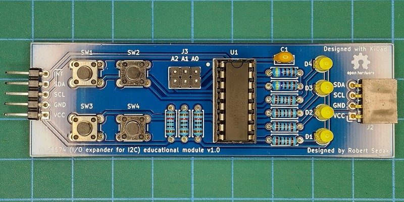
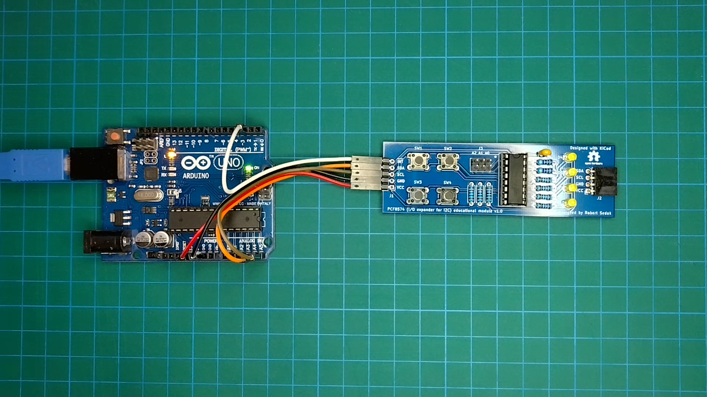

[Croatian version](README_HR-HR.md).

Introduction
============

Purpose of PCF8574 educational module is student education.

Contributor
------------
- Robert Sedak — features, Arduino programming, schematic design, CAD design.

Application
-----------
Robert Sedak made a video with example programmed in Arduino IDE:

You can download example for Arduino IDE from [here](examples/).

Bill Of Materials
-----------------
- 1 ea., PCB
- 4 ea., 1K ohm 1/4W 1% Resistor (R1, R2, R3, R4)
- 3 ea., 10K ohm 1/4W 1% Resistor (R5, R6, R7)
- 2 ea., 4.7K ohm 1/4W 1% Resistor (R8, R9)
- 4 ea., LED 3mm (D1, D2, D3, D4)
- 4 ea., 6x6x4.3mm SPST Momentary push switch (SW1, SW2, SW3, SW4)
- 1 ea., 100nF 50V Monolithic Ceramic Capacitor
- 1 ea., 16-Pin DIL IC Socket
- 1 ea., PCF8574
- 1 ea., 1x5 pin 2.54mm Right Angle Pin Header (J1)
- 1 ea., 1x4 pin 2.54mm Socket Connector - Right angle (J2)
- 1 ea., 2x3 pin 2.54mm Straight Pin Header (J3)

Design Files
------------
This project is designed using Open Source [KiCad](http://kicad.org/). Design files are located in the [design_files](design_files/) folder.  You can see the [schematic](images/PCF8574_educational_module_schematic.png).

Gerber files
------------
You can download gerber files from [here](gerber/PCF8574_educational_module.zip).

Firmware
--------
This project can be programmed using the Open Source [Arduino](https://www.arduino.cc/).
Arduino example is located in [examples](examples/) folder.

License
-------
[Attribution-ShareAlike 4.0 International (CC BY-SA 4.0)](https://creativecommons.org/licenses/by-sa/4.0/)

You are free to:
- Share — copy and redistribute the material in any medium or format
- Adapt — remix, transform, and build upon the material

This license is acceptable for Free Cultural Works.
- The licensor cannot revoke these freedoms as long as you follow the license terms.

Under the following terms:
- Attribution — You must give appropriate credit, provide a link to the license, and indicate if changes were made. You may do so in any reasonable manner, but not in any way that suggests the licensor endorses you or your use.
- ShareAlike — If you remix, transform, or build upon the material, you must distribute your contributions under the same license as the original.

No additional restrictions — You may not apply legal terms or technological measures that legally restrict others from doing anything the license permits.

Reference Designs ARE PROVIDED "AS IS" AND "WITH ALL FAULTS". Authors DISCLAIMS ALL OTHER WARRANTIES, EXPRESS OR IMPLIED, REGARDING PRODUCTS, INCLUDING BUT NOT LIMITED TO, ANY IMPLIED WARRANTIES OF MERCHANTABILITY OR FITNESS FOR A PARTICULAR PURPOSE.
Authors may make changes to specifications and product descriptions at any time, without notice. The Customer must notrely on the absence or characteristics of any features or instructions marked "reserved" or "undefined."
Authors reservesthese for future definition and shall have no responsibility whatsoever for conflicts or incompatibilities arising from future changes to them. The product information on the Web Site or Materials is subject to change without notice. Do not finalize a design with this info.

